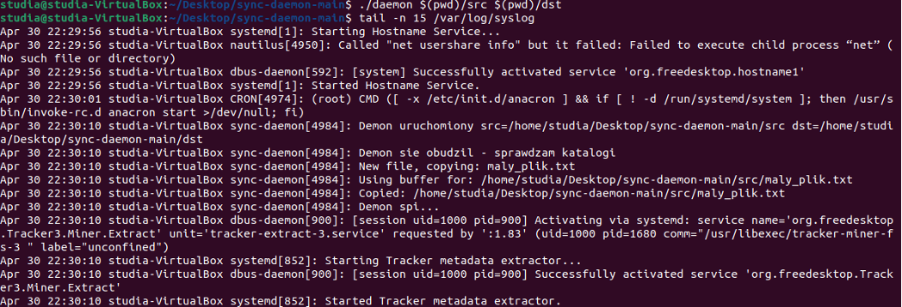
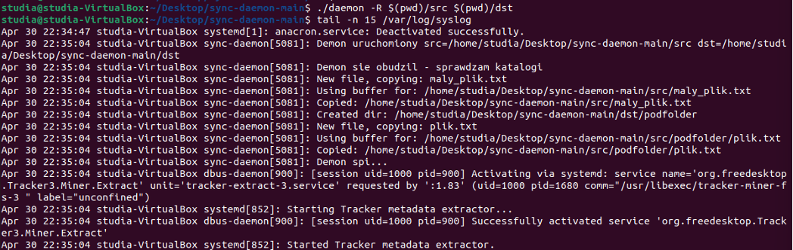
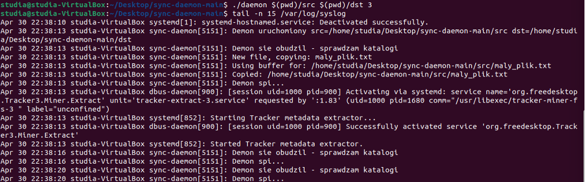
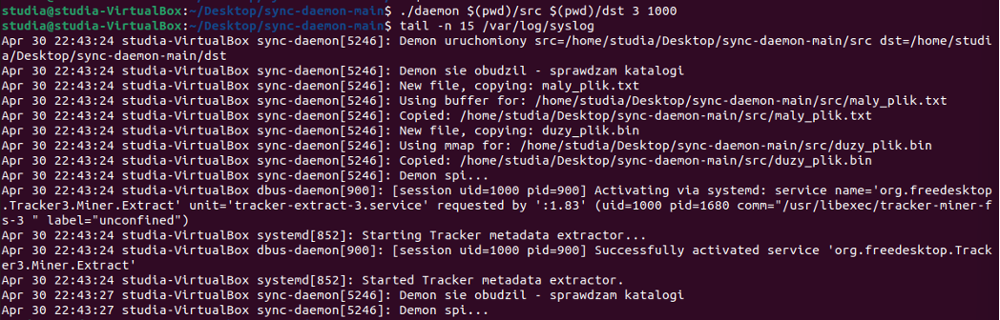

# sync-daemon

Demon synchronizujący dwa katalogi — projekt na Systemy Operacyjne (Politechnika Białostocka).

## Opis

Program działa jako demon systemowy — cyklicznie porównuje katalog źródłowy z docelowym i wykonuje niezbędne operacje kopiowania oraz usuwania plików. Wykorzystuje wyłącznie API Linuksa (syscalle POSIX).

## Demo

Podstawowa synchronizacja

Synchronizacja rekurencyjna (-R)

Niestandardowy czas uśpienia

Kopiowanie metodą mmap


## Kompilacja

```bash
make
```

## Użycie

```bash
./daemon [-R] <src> <dst> [czas_uspania] [prog_mmap]
```

### Parametry

| Parametr | Opis | Domyślnie |
|----------|------|-----------|
| `<src>` | Bezwzględna ścieżka do katalogu źródłowego | wymagany |
| `<dst>` | Bezwzględna ścieżka do katalogu docelowego | wymagany |
| `-R` | Rekurencyjna synchronizacja podkatalogów | wyłączona |
| `[czas_uspania]` | Czas uśpienia w sekundach | 300 |
| `[prog_mmap]` | Próg rozmiaru pliku dla mmap w bajtach | 1048576 (1MB) |

### Przykłady

```bash
# podstawowe użycie
./daemon /tmp/src /tmp/dst

# z rekurencją i czasem 60 sekund
./daemon -R /tmp/src /tmp/dst 60

# z własnym progiem mmap (512KB)
./daemon /tmp/src /tmp/dst 60 524288
```

## Zarządzanie demonem

```bash
# sprawdzenie PID
pidof daemon

# natychmiastowe wybudzenie
kill -SIGUSR1 <pid>

# zatrzymanie demona
kill <pid>

# czyszczenie plików binarnych
make clean
```

## Logi

```bash
# podgląd logów na żywo
journalctl -f | grep sync-daemon

# ostatnie 20 wpisów
journalctl | grep sync-daemon | tail -20
```

## Funkcjonalności

- Kopiowanie nowych plików z `src` do `dst`
- Kopiowanie zmodyfikowanych plików (porównanie `st_mtime`)
- Usuwanie nadmiarowych plików z `dst`
- Ustawianie daty modyfikacji po skopiowaniu (`utimensat`)
- Obsługa sygnału `SIGUSR1` — natychmiastowe wybudzenie
- Obsługa sygnału `SIGTERM` — graceful shutdown
- Rekurencyjna synchronizacja podkatalogów (`-R`)
- Kopiowanie małych plików przez `read/write`
- Kopiowanie dużych plików przez `mmap/write`

## Autorzy

- Miłosz(MajloszIS)
- Jakub
- Miłosz